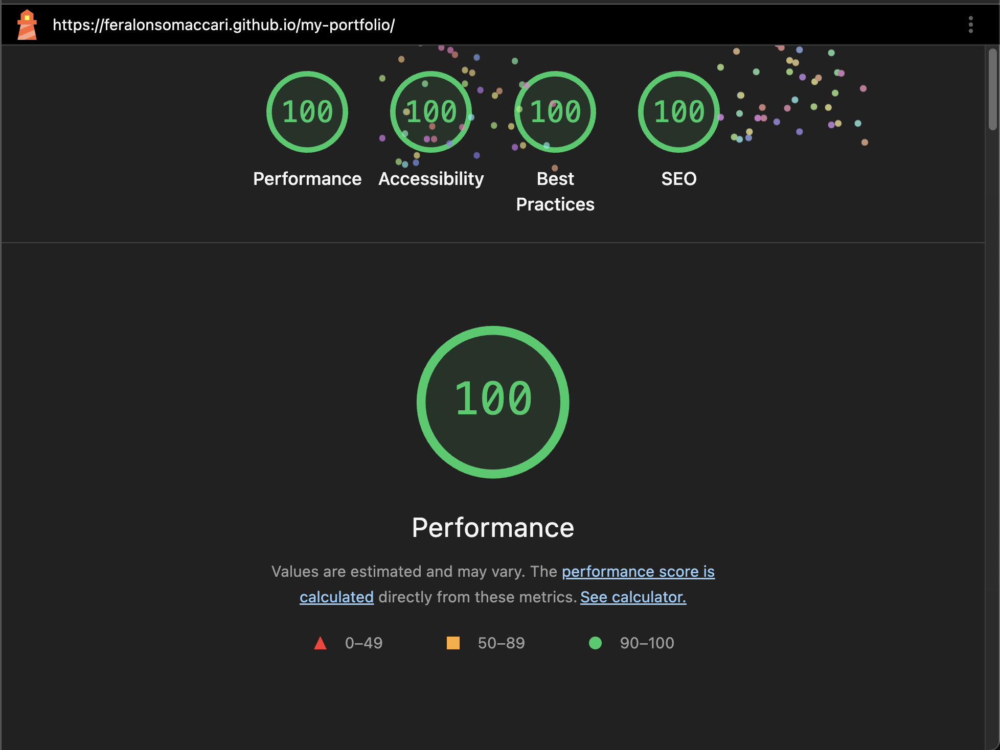

# My Portfolio

My portfolio website to showcase a bit about me.  
It was built without any frameworks or libraries - just pure JS, CSS, and HTML.

Content:
- Work experience
- Downloadable resume
- My links (LinkedIn, GitHub, etc.)
- Possibility of getting an outstanding high five

Live site: https://feralonsomaccari.github.io/my-portfolio/

